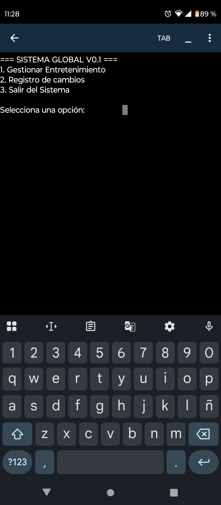
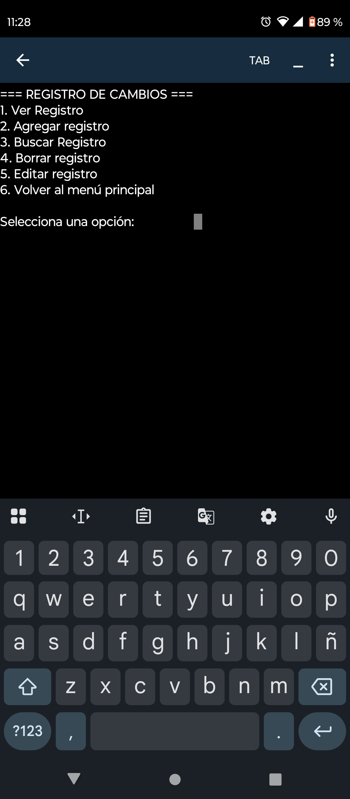
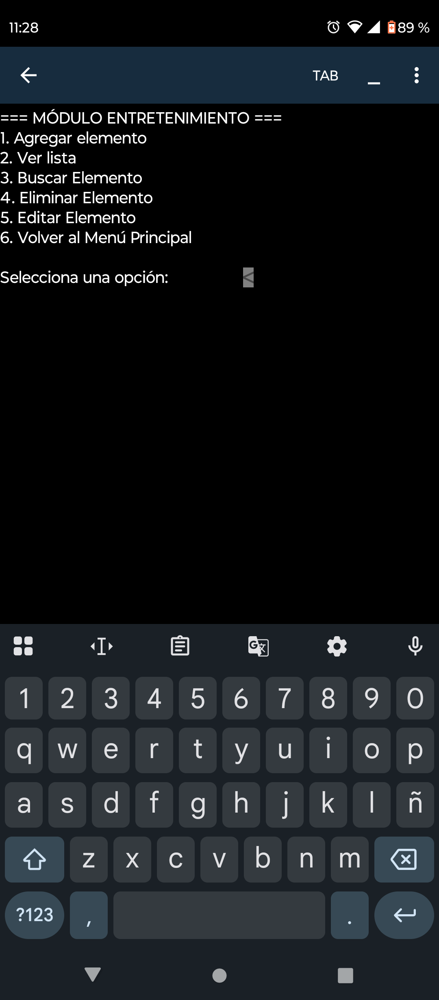

# Mi-Gestor-Cli-Python-
V0.2
Sistema CLI de Gestión de Entrenamiento Personal y Registro de Cambios en Python

Características principales:
CRUD completo (Crear, Leer, Editar, Eliminar) para el catálogo de entretenimiento.
Módulo de Logs con estampas de fecha automáticas y búsqueda por días.
Arquitectura modular (separación de persistencia, interfaz y flujo principal en archivos .py).
Persistencia: Almacenamiento local en archivos .txt.
Capturas de pantalla: Fotos de la terminal corriendo en Pydroid 3.

### Demostración del Sistema

